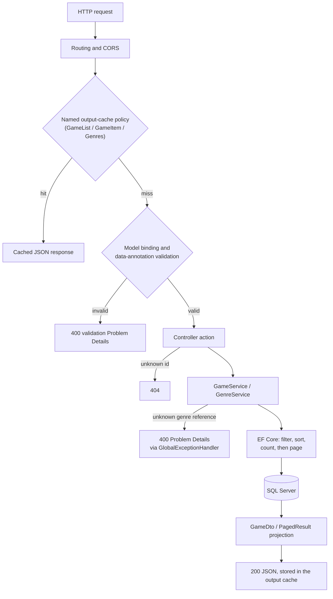
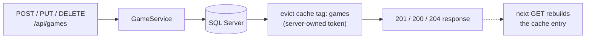
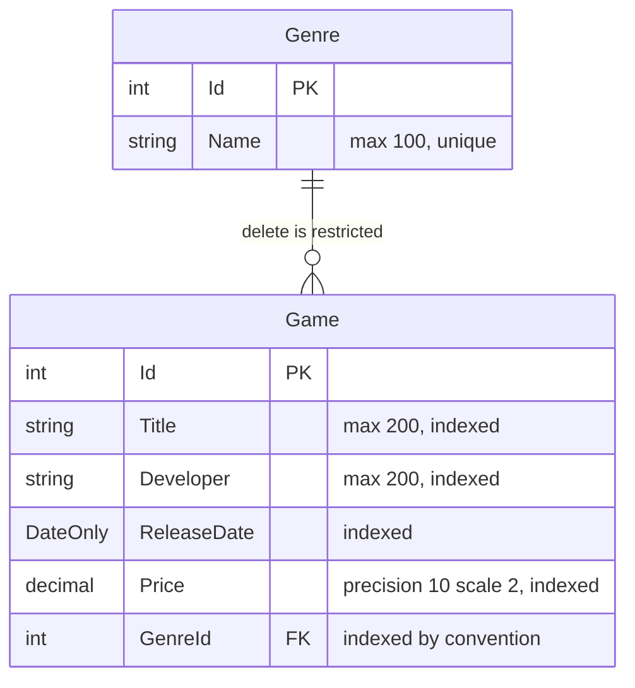

# Backend Domain

The backend is an ASP.NET Core Web API on .NET 10. It owns catalogue business validation,
persistence, query semantics, and the public HTTP contract.

For installation and platform-specific setup, see the [repository README](../README.md).

## Request Flow
# Backend Domain

The backend is an ASP.NET Core Web API on .NET 10. It owns catalogue business validation,
persistence, query semantics, and the public HTTP contract.

For installation and platform-specific setup, see the [repository README](../README.md).

## Request Flow

Every outcome a request can take, including both error branches:



### Query Parameter Journey

`GET /api/games` binds the query string into the typed `GameQuery` contract. Every parameter
is bounded before it can reach SQL:

| Parameter | Bound by | Effect in SQL |
| --- | --- | --- |
| `search` | `StringLength(200)` | `WHERE Title LIKE '%…%'` |
| `genre` | `StringLength(100)` | `WHERE Genre.Name = …` |
| `sort` | `GameSortField` enum | `ORDER BY` column choice |
| `order` | `SortDirection` enum | `ASC` / `DESC` |
| `page` | `Range(1, 10000)` | `OFFSET (page-1) * pageSize` |
| `pageSize` | `Range(1, 100)` | `FETCH NEXT pageSize` |

## Source Structure

```text
src/GameCatalog.Api/
├── Contracts/        Public API requests, responses, enums, and paging models
├── Controllers/      HTTP routes and status-code mapping
├── Data/             DbContext, migrations, and development seed data
├── Entities/         Persistence entities and relationships
├── Infrastructure/   Cross-cutting HTTP infrastructure
└── Services/         Application operations and query composition
```

## Layer Responsibilities

### Controllers

Controllers translate HTTP concerns into typed service calls. They should remain thin: model
binding, cancellation, status codes, and response selection belong here; EF Core queries do not.

### Contracts

Contracts are the public API boundary. Data annotations validate payloads before service
execution. `GameQuery` uses enums and bounded page values so only supported operations reach the
database. `PagedResult<T>` provides a consistent pagination envelope.

### Services

Services contain catalogue workflows and database query composition. Read queries use
`AsNoTracking`, project directly to DTOs, propagate cancellation tokens, and apply filtering
before counting and paging.

All paginated sorts finish with the unique game `Id`, ensuring deterministic page boundaries
when user-visible sort values are equal.

#### Search Trade-off

Title search translates to a leading-wildcard `LIKE '%…%'` over a lower-cased title. A leading
wildcard cannot seek the `Title` index, so every search scans the filtered set. This is a
deliberate choice for a catalogue of this size: it behaves identically on any collation and on
both database providers (SQL Server in production, SQLite in tests), and it keeps the query
composable with the genre filter, sorting, and paging. A production-scale catalogue would serve
the same API contract with SQL Server full-text search or a persisted, normalised search column
with its own index.

### Output Caching

ASP.NET Core Output Cache stores game responses for 60 seconds and genre responses for 10
minutes. Catalogue-list cache keys vary only by the supported search, genre, sort, order, page,
and page-size parameters; unknown query parameters cannot create redundant entries. Individual
game responses use a separate policy that ignores query parameters. Successful create, update,
and delete operations evict the `games` cache tag with a server-owned token after the database
write. The cache is in-process, requires no Redis service, and is also used by requests made
through Swagger UI.



### Data and Entities

`GameCatalogDbContext` configures SQL precision, lengths, indexes, and relationships. EF Core
migrations define the production schema. `DbSeeder` inserts development sample data only when
the catalogue is empty.



### Infrastructure

`GlobalExceptionHandler` converts known domain errors into RFC-compatible Problem Details. The
framework handles model-validation failures and unhandled server errors consistently.

Health checks are split by question. `/health` answers "is the process alive?" and deliberately
excludes external dependencies, so a database outage never causes the platform to restart a
healthy process. `/health/ready` answers "can the application serve requests?" and verifies
database connectivity; it turns a deployment whose startup migration failed (the degraded-mode
path in `Program.cs`) into a visible `503` instead of a silently broken site.

## Local Configuration

ASP.NET Core loads the standard `appsettings` files, environment variables, and command-line
configuration. This project then adds the ignored `appsettings.Local.json` as an optional final
developer override in `Program.cs`.

Keep credentials and machine-specific connection strings in `appsettings.Local.json` or in the
deployment environment, never in tracked configuration. Production deployments should provide
their own configuration and should not contain a local override file.

## Testing Strategy

The tests instantiate services against in-memory SQLite. Unlike EF Core's non-relational
InMemory provider, SQLite exercises SQL translation, ordering, constraints, and relational
behaviour without requiring a SQL Server test instance.

Current tests cover CRUD behaviour, validation contracts, filtering, paging, every sort field
in both directions, stable tie-breakers, unknown references on both create and update, and the
exception-to-Problem-Details mapping.

```bash
dotnet test
```

## Review Checklist

When adding backend code, verify that:

- public inputs are bounded and validated;
- controllers remain transport-focused;
- queries are asynchronous and accept cancellation tokens;
- read-only queries use `AsNoTracking`;
- paging happens after filtering and deterministic ordering;
- entities are not returned directly from controllers;
- expected domain failures map to intentional HTTP responses;
- schema changes include an EF Core migration;
- query behaviour is tested with a relational provider.

Every outcome a request can take, including both error branches:


### Query Parameter Journey

`GET /api/games` binds the query string into the typed `GameQuery` contract. Every parameter
is bounded before it can reach SQL:

| Parameter | Bound by | Effect in SQL |
| --- | --- | --- |
| `search` | `StringLength(200)` | `WHERE Title LIKE '%…%'` |
| `genre` | `StringLength(100)` | `WHERE Genre.Name = …` |
| `sort` | `GameSortField` enum | `ORDER BY` column choice |
| `order` | `SortDirection` enum | `ASC` / `DESC` |
| `page` | `Range(1, 10000)` | `OFFSET (page-1) * pageSize` |
| `pageSize` | `Range(1, 100)` | `FETCH NEXT pageSize` |

## Source Structure

```text
src/GameCatalog.Api/
├── Contracts/        Public API requests, responses, enums, and paging models
├── Controllers/      HTTP routes and status-code mapping
├── Data/             DbContext, migrations, and development seed data
├── Entities/         Persistence entities and relationships
├── Infrastructure/   Cross-cutting HTTP infrastructure
└── Services/         Application operations and query composition
```

## Layer Responsibilities

### Controllers

Controllers translate HTTP concerns into typed service calls. They should remain thin: model
binding, cancellation, status codes, and response selection belong here; EF Core queries do not.

### Contracts

Contracts are the public API boundary. Data annotations validate payloads before service
execution. `GameQuery` uses enums and bounded page values so only supported operations reach the
database. `PagedResult<T>` provides a consistent pagination envelope.

### Services

Services contain catalogue workflows and database query composition. Read queries use
`AsNoTracking`, project directly to DTOs, propagate cancellation tokens, and apply filtering
before counting and paging.

All paginated sorts finish with the unique game `Id`, ensuring deterministic page boundaries
when user-visible sort values are equal.

#### Search Trade-off

Title search translates to a leading-wildcard `LIKE '%…%'` over a lower-cased title. A leading
wildcard cannot seek the `Title` index, so every search scans the filtered set. This is a
deliberate choice for a catalogue of this size: it behaves identically on any collation and on
both database providers (SQL Server in production, SQLite in tests), and it keeps the query
composable with the genre filter, sorting, and paging. A production-scale catalogue would serve
the same API contract with SQL Server full-text search or a persisted, normalised search column
with its own index.

### Output Caching

ASP.NET Core Output Cache stores game responses for 60 seconds and genre responses for 10
minutes. Catalogue-list cache keys vary only by the supported search, genre, sort, order, page,
and page-size parameters; unknown query parameters cannot create redundant entries. Individual
game responses use a separate policy that ignores query parameters. Successful create, update,
and delete operations evict the `games` cache tag with a server-owned token after the database
write. The cache is in-process, requires no Redis service, and is also used by requests made
through Swagger UI.


### Data and Entities

`GameCatalogDbContext` configures SQL precision, lengths, indexes, and relationships. EF Core
migrations define the production schema. `DbSeeder` inserts development sample data only when
the catalogue is empty.


### Infrastructure

`GlobalExceptionHandler` converts known domain errors into RFC-compatible Problem Details. The
framework handles model-validation failures and unhandled server errors consistently.

Health checks are split by question. `/health` answers "is the process alive?" and deliberately
excludes external dependencies, so a database outage never causes the platform to restart a
healthy process. `/health/ready` answers "can the application serve requests?" and verifies
database connectivity; it turns a deployment whose startup migration failed (the degraded-mode
path in `Program.cs`) into a visible `503` instead of a silently broken site.

## Local Configuration

ASP.NET Core loads the standard `appsettings` files, environment variables, and command-line
configuration. This project then adds the ignored `appsettings.Local.json` as an optional final
developer override in `Program.cs`.

Keep credentials and machine-specific connection strings in `appsettings.Local.json` or in the
deployment environment, never in tracked configuration. Production deployments should provide
their own configuration and should not contain a local override file.

## Testing Strategy

The tests instantiate services against in-memory SQLite. Unlike EF Core's non-relational
InMemory provider, SQLite exercises SQL translation, ordering, constraints, and relational
behaviour without requiring a SQL Server test instance.

Current tests cover CRUD behaviour, validation contracts, filtering, paging, every sort field
in both directions, stable tie-breakers, unknown references on both create and update, and the
exception-to-Problem-Details mapping.

```bash
dotnet test
```

## Review Checklist

When adding backend code, verify that:

- public inputs are bounded and validated;
- controllers remain transport-focused;
- queries are asynchronous and accept cancellation tokens;
- read-only queries use `AsNoTracking`;
- paging happens after filtering and deterministic ordering;
- entities are not returned directly from controllers;
- expected domain failures map to intentional HTTP responses;
- schema changes include an EF Core migration;
- query behaviour is tested with a relational provider.
