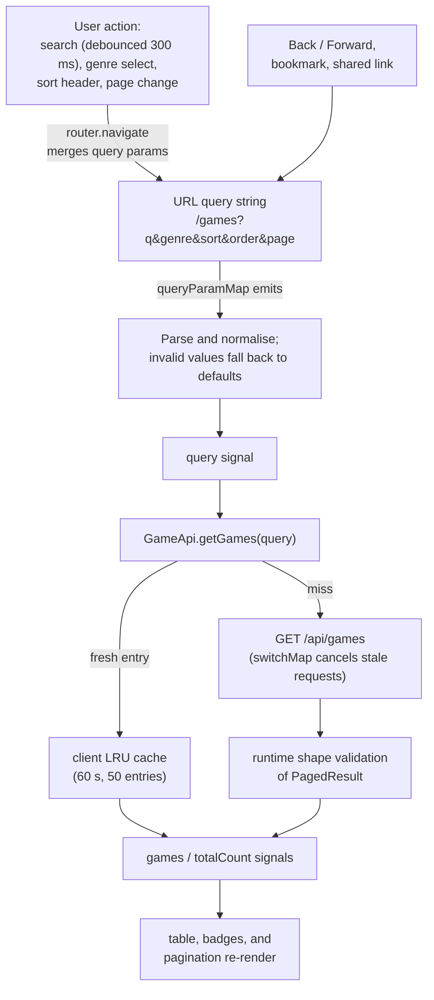

# Frontend Domain

The frontend is the Angular 22 client for **Video Game Catalogue**. It owns presentation,
navigation, browser state, client-side validation, and communication with the backend API.

For complete installation instructions, see the [repository README](../README.md).

## Runtime and Tooling

- Angular 22 with standalone components
- TypeScript 6 with strict compiler settings
- Angular Router with lazy-loaded routes
- Angular Reactive Forms
- Angular Signals for local view state
- RxJS for asynchronous request orchestration
- Bootstrap 5 and ng-bootstrap
- Vitest through the Angular test builder

## Application Structure

```text
src/app/
├── core/       Infrastructure used across the application
├── features/   Routable product capabilities
├── shared/     Reusable UI, models, constants, and utilities
├── app.ts      Root application shell
├── app.html    Global navigation and route outlet
├── app.config.ts
└── app.routes.ts
```

More detailed documentation is located next to each architectural area:

- [`core/README.md`](src/app/core/README.md)
- [`features/README.md`](src/app/features/README.md)
- [`features/games/README.md`](src/app/features/games/README.md)
- [`shared/README.md`](src/app/shared/README.md)

## Dependency Direction

- The application shell composes routes, global services, and shared presentation.
- Features may depend on `core` and `shared`.
- `core` must not depend on a feature.
- `shared` must not depend on a feature.
- Feature-specific behaviour stays inside its feature instead of being promoted prematurely.

Cross-layer imports use `@core/*` and `@shared/*`. Relative imports are preferred inside a
single feature because they keep that feature movable.

## State Management

No global state library is required for the current application size:

- Signals hold component-local state.
- The router query string is the source of truth for catalogue filters, sorting, and paging.
- Reactive Forms own editable form state.
- `ToastService` owns short-lived application notifications.
- Backend data remains server-authoritative and is not duplicated into a client store.

This keeps state ownership explicit while preserving shareable URLs and browser navigation.

## Data Flow

Catalogue state travels in one direction. User actions never mutate the table directly;
they update the URL, and the URL drives everything else. Browser navigation and shared
links enter the same loop at the same point:



Create, update, and delete calls clear the client cache, so the next catalogue query always
reflects the write (the backend evicts its output cache the same way).

## API Boundary

`GameApi` is the only class that constructs backend URLs. Components receive typed observables
and do not use `HttpClient` directly. The paginated catalogue response is checked at runtime so
an incompatible backend response becomes an explicit error rather than corrupting view state.

During development, `proxy.conf.json` forwards `/api` to `http://localhost:5161`.

## Commands

```bash
npm ci
npm start
npm run lint
npm run build
npm run test:ci
npm run check
```

`npm run check` reproduces the complete frontend CI sequence locally: strict ESLint, production
build, and the one-shot test suite. The production build uses bundle budgets configured in
`angular.json`.

## Review Checklist

When adding frontend code, verify that:

- a feature owns its domain-specific components and state;
- reusable code is genuinely feature-independent before moving it to `shared`;
- route-visible state is represented in the URL when appropriate;
- subscriptions are finite or tied to component destruction;
- loading, empty, error, and success states are handled;
- forms have matching frontend and backend validation;
- interactive controls remain keyboard and screen-reader accessible;
- new behaviour has a focused test.
